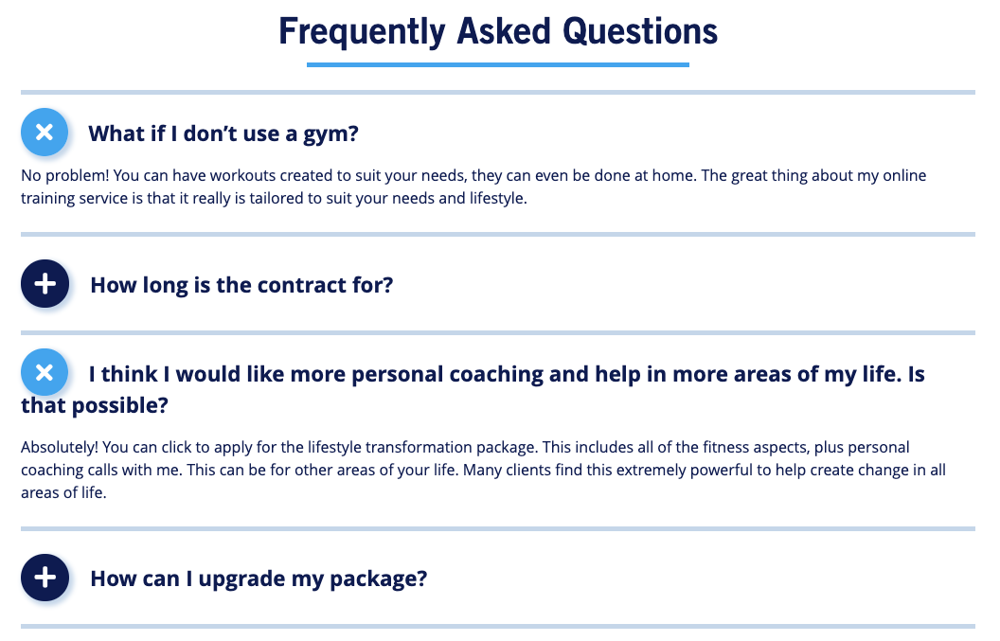

# Community Project - Intra Fitness

This is the capstone project at RED Academy Web Developer Program, where we applied all we have learned to create a fully functioning website for a real client. It also involved working in an Agile team and collaborating through GitHub.

## Technologies used

- Wordpress 5
- HTML 5
- CSS 3
- PHP 7
- Sass
- Gulp
- JavaScript ES6
- jQuery
- Git
- GitHub
- Trello
- Dploy

## Approach used

In this challenging project, the team made an effort to keep as much of the content as possible in the CMS (Wordpress) in order to make it easily editable by the client. For that, custom pages and custom post types were created. For example, a special post type was created for testimonials and another for FAQs, so they can be updated by the end user. Even so, the FAQ posts appear on page in a very customized style.

## Main Takeaways

1 - Agile project management methodologies like Kanban can help a small team to stay on track and focus on production.

2 - Regular and clear communication is key for the success of a team developing the same website, since the work one does may greatly affect the work of another.

3 - Git and GitHub provide an excellent, reliable and traceable way to control the development history.
